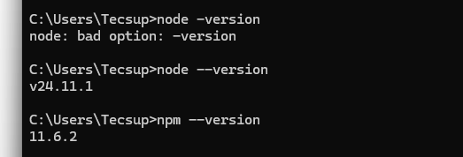
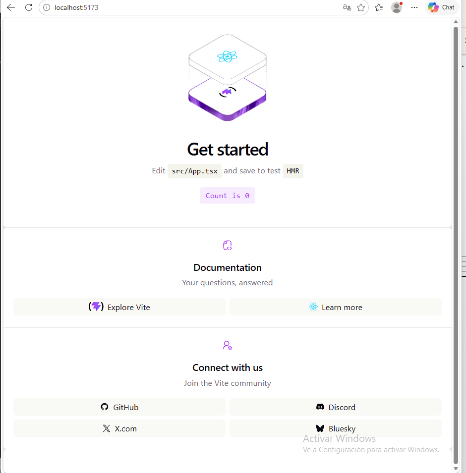
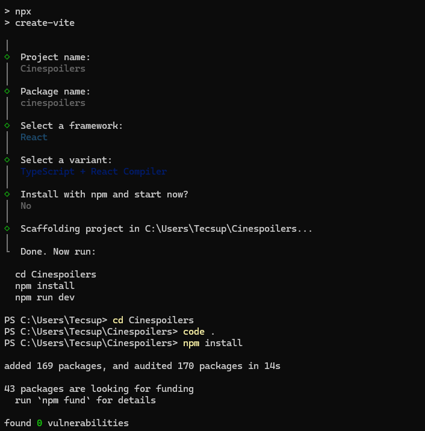
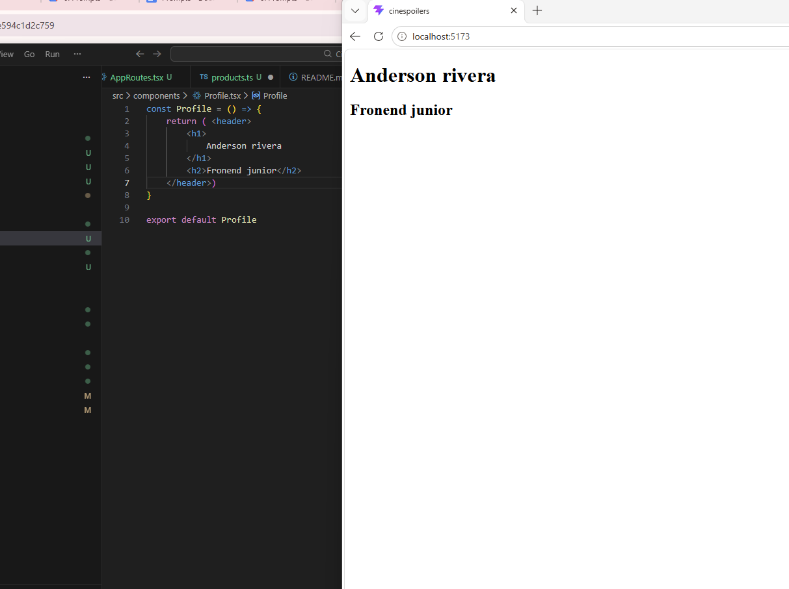

# 🚀 Frontend Grupal React Projects

Repositorio grupal que reúne los proyectos frontend desarrollados por el equipo utilizando React y tecnologías modernas del ecosistema JavaScript.

Cada proyecto se encuentra integrado mediante Git Submodules para mantener independencia entre repositorios y organización profesional del trabajo colaborativo.

---

# 👨‍💻 Integrantes

| Integrante | Proyecto |
|---|---|
| Anderson Rivera | CineSpoilers |
| Yojhan Huancca | CinEPlis |
| Carlos Carbajal | |

---

# 🛠️ Tecnologías utilizadas

- React
- TypeScript
- Vite
- TailwindCSS
- React Router
- Zustand
- Git Submodules

---


# 📌 ¿Qué es este repositorio?

Este repositorio funciona como contenedor principal de múltiples proyectos frontend independientes.

Cada carpeta corresponde a un repositorio Git distinto integrado mediante submodules.

---

# ⚙️ Clonar el proyecto correctamente

## Clonar junto con submodules

```bash
git clone --recurse-submodules URL_DEL_REPOSITORIO
```

---

# 📥 Si ya clonaste el repositorio

Ejecutar:

```bash
git submodule update --init --recursive
```

---

# 🚀 Ejecutar proyectos

Entrar al proyecto deseado:

```bash
cd cinespoilers
```

Instalar dependencias:

```bash
npm install
```

Ejecutar servidor:

```bash
npm run dev
```

---

# 🖼️ Capturas del proyecto

## 📌 Instalación de Node.js



---

## 📌 Inicialización del proyecto



---

## 📌 Creación del proyecto con Vite



---

## 📌 Primer componente React



---

# 02 🖼️ Capturas del proyecto

# Documentación de CinEPlis

## 1. Verificar versiones de Node.js y npm


## 2. Crear proyecto con Vite


## 3. Iniciar el servidor de desarrollo


## 4. Ejecutar comando para mostrar nombre del proyecto


## 5. Ejecutar comando para mostrar nombre del proyecto


## 6. Crear un componente React


# 🎯 Objetivos del proyecto

- Aprender React moderno
- Implementar arquitectura frontend básica
- Trabajar colaborativamente con Git
- Utilizar Git Submodules
- Construir proyectos escalables

---

# 📌 Estado actual

✅ Repositorio grupal configurado  
✅ Submodules integrados  
✅ React + Vite configurado  
✅ Proyectos independientes funcionando  
✅ Arquitectura frontend inicial implementada  

---

# 🔥 Integración Git Submodules

Agregar submodule:

```bash
git submodule add URL_DEL_REPO nombre-carpeta
```

Actualizar submodules:

```bash
git submodule update --remote
```

Inicializar submodules:

```bash
git submodule update --init --recursive
```

---

# 👨‍💻 Equipo de desarrollo

Proyecto desarrollado por el equipo Frontend React 🚀
